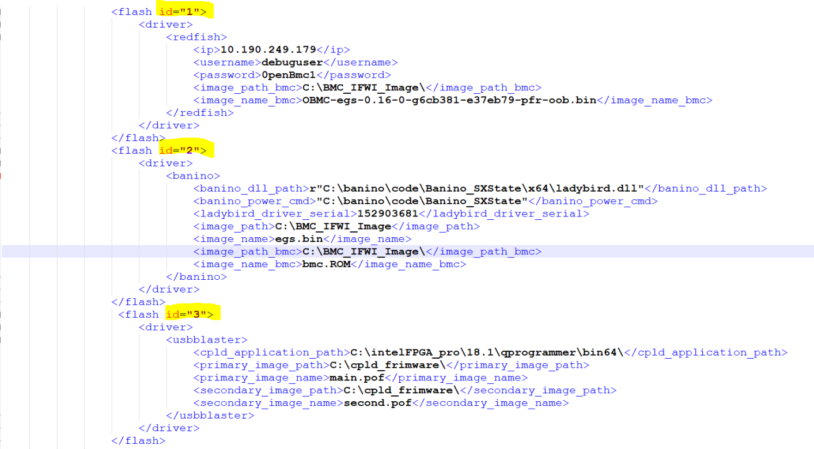

<u><b>BMC Flashing:</b></u>

To keep all the provider configurations under a single provider name to avoid editing the system_configuration.xml, we should use a differentiator like an id on the top tree of the provider tag, like below.

* We have used single provider name called <flash> with the id.
* The id can be anything but should be unique identifier of the tag.
* We have used 3 types of drivers in the below configuration,
    * Redfish
    * Banino
    * CPLD

Each of the drivers has their own specifications, and same top tag name differentiated by the id,

    * <flash id = “1”> - Redfish
    * <flash id = “2”> - Banino
    * <flash id = “3”> - CPLD – usbblaster



<b>Redfish:</b>

Below is the redfish configuration that should be copied to system_configuration.xml file before using the redfish flash provider.
````
<flash id="1">
    <driver>
        <redfish>
            <ip>10.190.249.179</ip>
            <username>debuguser</username>
            <password>0penBmc1</password>
            <image_path_bmc>C:\BMC_IFWI_Image\</image_path_bmc>
            <image_name_bmc>OBMC-egs-0.16-0-g6cb381-e37eb79-pfroob.bin</image_name_bmc>
        </redfish>
    </driver>
</flash>
````
<b>Banino:</b>

Below is the Banino configuration that should be copied to system_configuration.xml file before using the banino flash provider.
````
<flash id="2">
    <driver>
        <banino>
            <banino_dll_path>r"C:\banino\code\Banino_SXState\x64\ladybird.dll"</banino_dll_path>
            <banino_power_cmd>"C:\banino\code\Banino_SXState"</banino_power_cmd>
            <ladybird_driver_serial>152903681</ladybird_driver_serial>
            <image_path>C:\BMC_IFWI_Image</image_path>
            <image_name>egs.bin</image_name>
            <image_path_bmc>C:\BMC_IFWI_Image\</image_path_bmc>
            <image_name_bmc>bmc.ROM</image_name_bmc>
            <rasp>false</rasp> # Temporary tag
        </banino>
    </driver>
</flash>
````

<b><u>CPLD Flashing:</u></b>

<b>Usb Blaster:</b>

Below is the cpld configuration that should be copied to system_configuration.xml file before using the cpld flash provider.
````
<flash id="3">
        <driver>
            <usbblaster>
                <cpld_application_path>C:\intelFPGA_pro\18.1\qprogrammer\bin64\</cpld_application_path>
                <primary_image_path>C:\cpld_frimware\</primary_image_path>
                <primary_image_name>main.pof</primary_image_name>
                <secondary_image_path>C:\cpld_frimware\</secondary_image_path>
                <secondary_image_name>second.pof</secondary_image_name>
            </usbblaster>
        </driver>
</flash>
````