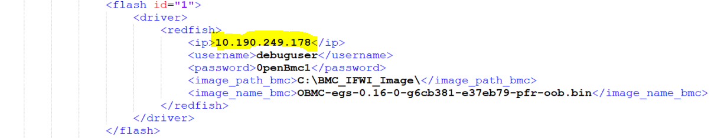

# DTAF-CONTENT FRAMEWORK

Domain-specific libraries and test content for the Datacenter Test Automation
Framework.

# **DPG - E2E Provisioning Automation BKM**

## Versioning:

|Rev No|Change Description|Rev Date|Effective Date|
|-------|-----------------|------------|------------------|
|Version 1.0| Created E2E provisioning BKM |18th Feb 2021|18th Feb 2021|

E2E provisioning supports following things for the user,

1. **_CPLD Flashing_**
    * Via USB Blaster --> [CPLD Flashing BKM](Flashing_cpld_bkm.md)
2. **_IFWI Flashing_**
3. **_BMC Flashing_**
    * Via Banino
    * Via Redfish
4. **_OS Installation_**
    * RHEL
    * Windows
    * ESXi
    * CentOS
5. **_Post OS installation_**
    * RHEL & CENT OS
        * Python Installation
        * Xmlcli Enablement
        * Yum repo Enablement
        * SSH Enablement
    * Windows
        * Python Installation
        * Xmlcli Enablement
        * SSH Enablement
   
To configure the system_configuration.xml file with the above flashing configurations, please refer the mentioned BKM ---> [Flashing provider configuration BKM (BMC Flashing, CPLD Flashing)](Flashing_provider_configuration_bkm.md)

A system_configuration.xml file has been placed here path for your reference --->[system_configuration.xml](readme_support_docs/system_configuration.xml)

BKM on how to use the above provisioning are mentioned in the below BKM,
   * The BKM has the below information,
      * How and where to create sut_inventory.cfg file on host machine.
      * How to call offline and online scripts of OS installation and flashings.

BKM Link --->[E2E Provisioning One Liner](E2E_Provisioning_One_liner.md)

## **Hardware Setups:**
   * Get PDU Credentials and its power outlet number / Rpi IP address for power cycling.
   * Banino (SX State and all other connections.
   * Connect a USB pen-drive on Banino village board.
      * 16 GB or 32 GB pendrive for Linux OS installation. Preferred Models à HP, PNY, TRANSCEND and SANDISK.
   * Get USB drive where it gives out a shorter name and connect it on Banino controller.
   * Connect USB Blaster and Install Quartus Application (contact lab support) and click on Auto Detect button and you should see the below chip information.
      * USBBlaster - Post code Reading, refer the BKM → [USB Blaster - Postcode Reading](USB_Blaster_Postcode_Reading.md)
      * 
   * BMC Serial COM port configuration (port will get differ platform to platform).
   * 
   * IFWI Serial COM port configuration (port will get differ platform to platform).
   * 
   * Ethernet connectivity to platform and platform BMC.
   * Connect ITP to use the Auto mode of OS installation.
   * KVM and Camera if necessary.

## **Pre-requisites: (Must to Follow)**
   * Install python 3.6 by downloading this python package → [python-3.6.0-amd64.exe](readme_support_docs/python-3.6.0-amd64.exe)
   * Install python dependency packages from dtaf_content and dtaf_core Frameworks, the packages can be installed by giving the direct path of the requirements file that can be found under the below paths highlighted in yellow, the path will change as per where you clone the framework.
   * Just by substituting the correct path in place of <mark>xxxx</mark>, the below command will install the packages for you.
   * **dtaf_core** - pip install --proxy=http://proxy01.iind.intel.com:911 -r <mark>C:\xxxx\dtaf_core\requirements\requirements_ut_py37.txt</mark>
   * **dtaf_content** - pip install --proxy=http://proxy01.iind.intel.com:911 -r <mark>C:\xxxx\dtaf_content\requirements_py3.txt</mark>
   * Setup Cscripts and pythonSV, refer the BKM on how to set up → [PythonSv_Cscripts_BKM.docx](readme_support_docs/PythonSv_Cscripts_BKM.docx)
   * Install Command Center Sprinter from the below link,
      *  [https://commandcenter.iind.intel.com/SprinterBuilds/Download](https://commandcenter.iind.intel.com/SprinterBuilds/Download)
         
         
   * Add appropriate environment variables under the name – PYTHONPATH, in the system variables rather than user variables.
      * For dtaf_content Framework – “C:\DPG_Automation\dtaf_content”
      * For dtaf_core Framework – “C:\DPG_Automation\dtaf_core\src”
      * For cscripts – “C:\cscripts“
      * For PythonSv - “C:\PythonSV“
      * For Python – “C:\Program Files\Python36\Scripts” – wherever the python installed.
      * 
   * Download the Banino zip and extract to host under C: drive→[banino.zip](readme_support_docs/banino.zip)
   * Refer the BKM on how to setup banino dc power and Sx State configuration post hardware connection, configure it as per the BKM -> [Banino_bkm.docx](readme_support_docs/Banino_bkm.docx)
   * DDI Request – For static IP configuration for both BMC and the Platform – (Send a request mail to “M, EswarareddyX”)
   * Check for BMC IP address change every time post flashing the full stack .ROM image on BMC, if the IP changed, please update the new ip in system_configuration.xml file.
   * 
   * Create **debuguser** every time post flashing the full stack .ROM image on BMC, for creating the user, open putty and load the BMC_CONSOLE with the configured **COM** port and log in as **root** user, then run the below commands sequentially,
      1. ipmitool user set name 2 debuguser
      1. ipmitool user set password 2 0penBmc1
      1. ipmitool user enable 2
      1. ipmitool channel setaccess 1 2 ipmi=on privilege=4
      1. ipmitool channel setaccess 3 2 ipmi=on privilege=4
      * 
   * Putty should always be closed before running the provisioning.
   * USB Blaster / Post code Application must be closed before running the provisioning.
   * HDD / SSD which has RHEL OS will not support for Windows OS installation.
   * Before triggering any OS installation scripts, based on what OS is going to get installed, update your <mark>system_configuration.xml</mark> file accordingly.
   * Make sure to update all the names of SSD/HDD which are connected to the SUT in the <mark>sut_inventory.cfg</mark> file if it is a manual mode OS installation.

 ## **Issues faced:**

<mark>**ITP failure: General checks:**</mark>

   * Check for proper cable connections on host and SUT.
   * Check PythonSv and Cscripts path set correctly in the environment path.
   * Check PythonSv folder is update to date under C: drive.
   * Check latest Cscripts is placed under C: drive
   * After above checks are performed, still problem persists, restart the host and sut once and then check ITP again.
   * Still persists, cross verify the ITP configuration again by using the below mentioned BKM,
   * \\bdcspiec010\File_Transfer\Automation_status\EGS\PythonSv_Cscripts_BKM.docx
   * If all are good in terms of configuration, but the problem still there, open terminal and manually start the PythonSV from the below folder and see the error message for your issue.
   * C:\PythonSV\sapphirerapids
   * If none of the above resolves your issue, please contact the person who configured the ITP device.

<mark>**Curl failed to download:**</mark>

   * Check Host machine proxy settings, Go to -> **Proxy settings** -> **Automatically detect settings** --> **ON** and try again. Still problem with curl, proceed with below step.
   * Curl server might have restarted, due to that service might have stopped, please contact Suresh.S@intel.com to enable it.

<mark>**Successful OS installation – Result failed:**</mark>

   * This happens when the SUT IP address is not static, after installation OS, IP address might have been changed that resulted in ping failed and the result also failed. Please set the SUT IP static and trigger the installation.

<mark>**Successful IFWI Flashing – Result failed:**</mark>

   * This happens when the BIOS entry menu is not detected, to resolve this, please restart the host once and try again.
   * Flush the serial port and verify serial port number is same as before (mentioned in the sys_configuration.)

<mark>**PDU did not do power on / off:**</mark>

   * Check the PDU information in the system_configuration.xml
   * Provided all the PDU information are correct in the system_configuration.xml, this problem occurs randomly, which we have no control over, so manually open PDU controller from browser and do the power cycle once and start the script again.

<mark>**BMC flashing failing via Redfish:**</mark>

   * Verify whether debuguser has been created or not.
   * Check for all the python modules are installed and environment path as set correctly.

<mark>**Error: Could not find the manifest path:**</mark>

   * Please select the latest framework build and run the test setup again.
   * Even after selecting the latest build, the error persists, please contact blazej.stanisz@intel.com and command center team.

<mark>**Error: Due to Software and File Size Limitation FAT32 Format Connect only 32gb or less For Linux OS Installation:**</mark>

   * Connect only 16 or 32 GB USB drive for RHEL OS installation and trigger again

<mark>**Sprinter Client Error: Unable to establish communication on port (ex:12344):**</mark>

   * Raise an IT ticket to unblock the port on host device, so that the communication can happen from sprinter to command center.

<mark>**Sprinter Client Error: Exception occurred while executing test package in EEC:**</mark>

   * Restart the sprinter client, still same exception, restart the host and try again.

<mark>**SPI BMC/BIOS chip detection issue:**</mark>

   * Flash the latest firmware version and physical connection check.

<mark>**SPI chip verification fail issue with BMC chip:**</mark>

   * After erase and write, the verification fails, but the flashing happens, so you can ignore this fail.

<mark>**Banino USB Switch to SUT Not Happening:**</mark>

   * Physical connection check (probably faulty USB cable)

<mark>**Banino is not responding after long idle time:**</mark>

   * Banino power adapter unplug and plug it back.

<mark>**AC power off is not happening but says performed ac power off:**</mark>

   * This is a random issue, please try again.
   * Check the PDU configuration details in system_configuration.xml file. 

<mark>**USB Blaster loses its power after an idle time:**</mark>

   * USB cable unplug and plug it back.

<mark>**ITP not responding loose power and physical intervention required:**</mark>

   * Remove the ITP power adapter and plug it back.

<mark>**Host USB port are not powering the instrumentations and other hardware connected:**</mark>

   * USB powered hub to be connected.

<mark>**KVM issue Keyboard and mouse not working in SUT:**</mark>

   * Remove the KVM power adapter and plug it back.
   * If the problem arise frequently, replace the KVM USB cable or the KVM hardware itself.

<mark>**CC Timeout – Terminated by Timeout:**</mark>

   * This will happen if you give a shorter timeout for the Test setup execution, so give a maximum timeout that you feel suitable, for example (one day)

<mark>**SUT did not boot after Flashing:**</mark>

   * Wait for some 30 minutes maximum, still the platform does not boot, probably the platform got stuck in some post code, using usb blaster read the post code and take necessary action.
   * If unable to read the post code, and the platform still did not boot, please use PDU and do a power cycle.
