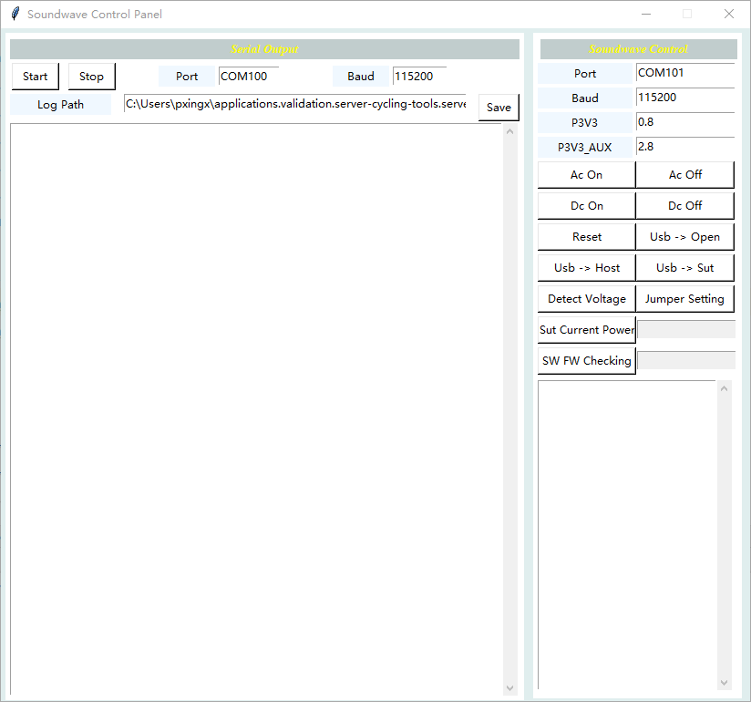
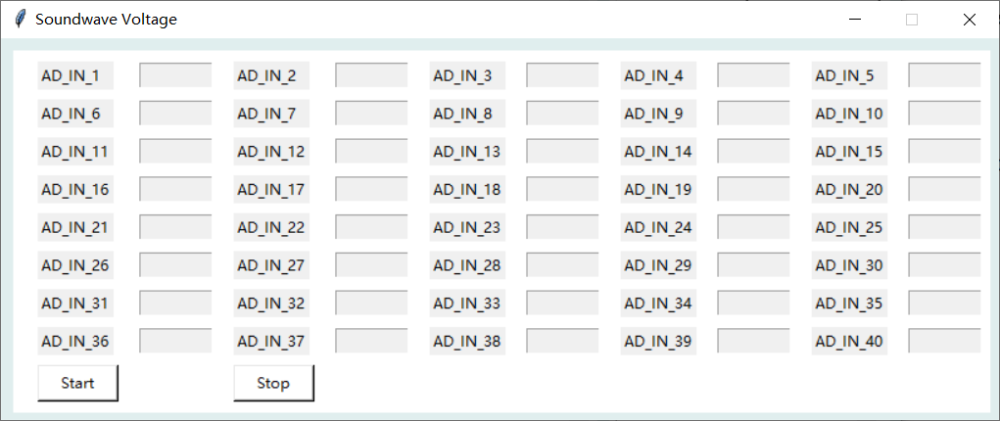
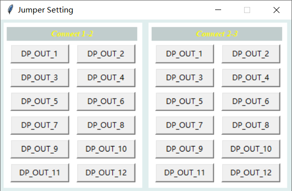

# User Guide for sw_panel.exe

#### Build Steps and Requirement
1. Download and install python3
2. Install python packages __serial__ and __pyinstaller__
   ```
   pip install pyserial --proxy=child-prc.intel.com:913
   pip install pyinstaller --proxy=child-prc.intel.com:913
   ```
3. Modify source code in sw_panel\sw_panel.py
4. Update the variable __pkgpath__ in sw_panel\build.bat line1 and fill in your pythonpath, default is C:\\Python36\\Scripts
3. Running sw_panel\build.bat to genurate executable tool sw_panel.exe


#### Soundwave Function Introduction


* Serial Output Block
    * Port: fill in serial port number
    * Baud: set number to 115200
    * Start: start to show serial log in below textbox
    * Stop: stop to show serial log in below textbox
    * Save: save serial log to serial.log in local host
    
* Soundwave Control Block
    * Port:              soundwave main port
    * Baud:              set number to 115200
    * P3V3:              lowest voltage number(whitley is 0.8)
    * P3V3_AUX:          highest voltage number(whitley is 2.8)
    * Ac On:             power sut and start up(G3->S0)
    * Ac Off:            shutdown and cut off sut power(S0->G3)
    * Dc On:             start up sut(S5->S0)
    * Dc Off:            shutdown sut(S0->S5)
    * Reset:             force reboot sut to S0(need to connect soundwave SP_OUT_3 to sut reset pin)
    * Usb->Open:         switch usb to open
    * Usb->Host:         switch usb to host
    * Usb->Sut:          switch usb to sut
    * SW FW Checking:    check current firmware version
    * Sut Current Power: show current sut status(S0/S5/G3)
    * Detect Voltage:    start/stop detect all pins voltage continuously  
        
    * Jumper Setting:    all of the 12 jumpers DP_OUT_1 to DP_OUT_12 have 3 pins, the button in Connect 1-2 used to enable pin1 and pin2 and button in Connect 2-3 uesd to enable pin2 and pin3  
        
