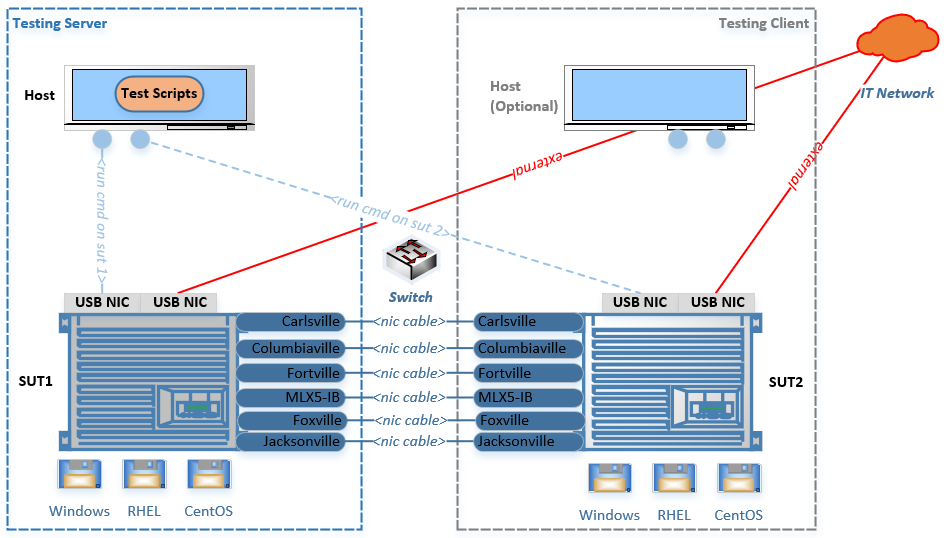

## Network Automation Setup Guide

### Hardware Setup Topology (<font color=red>Mandatory</font>)

```text
1. "Test Server" should be fully configured with power control box (soundwave, banino+pdu, ...) and bios serial cable
2. "Test Client" must be "power on to OS" before running scripts
3. All test NICs must be connected on both SUTs
4. 3 HDD/SSD should be connected to both SUTs, for different sutos installation
5. Each NIC config is built on <network connection>, it's representation of "network packet flow"
6. All networking scripts use the "Pre-Defined" connections in "config.nic_config() in src/network/lib/config.py"
```


### Test Automation Execution
Wiki Page: https://wiki.ith.intel.com/display/testing/Network+Precondition+for+CC

```text
1. SUT environment/tools preparation
    a. Connect two SUTs to IT public network
    b. Keep "SUT Client" in OS before all testing
    b. Copy src/network/lib/deploy/network_env.bat/.sh to sutos, run it
    d. For Windows OS, when it show you the GUI windows for tool install, please manual install the tool
    e. If tools update required, download it from tcd preparation link, and replace the old one in: root@10.239.115.67:/localdisk/test_tools/network
2. Base lib infrastructure configuration
    a. C:\Automation\tkconfig\sut\network_server.ini 
    b. C:\Automation\tkconfig\sut\network_client.ini
    c. C:\Automation\tkconfig\system_configuration.xml
3. Executors pick up tests from test plan: automation_testcases/network_bhs_allnic.ini
4. Executors check and modify nic connection based on above graph
5. Running tests locally: Python testscript.py --param=value ...
6. If with CC scheduler, refer to:  
    a. https://wiki.ith.intel.com/pages/viewpage.action?pageId=2122610410
    b. https://wiki.ith.intel.com/display/testing/Schedule+Test+Plan+with+Command+Center
```
