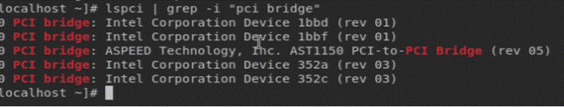

**Hardware Setups:**

1. In order to run the PCIe test cases, We need to have Pcie cards to be inserted in any of the socket

**Pre-requisites: (Mandatory)**
1. Before running the test cases, Please update the below configurations in Content_configuration.xml file,

**Path for file:** src/configuration/content_configuration.xml 
**Content to update:** 
<content><ras>
<einj_pcie_bridge_values>**_37:01.0,80.05.0_**</einj_pcie_bridge_values>
</ras></content>

**Steps to find the pcie bridge Values**
1. Run the below command in SUT and fetch the BDF Bridge Value.
`[root@localhost ~]# lspci | grep -i "pci bridge"`

00:0d.0 PCI bridge: Intel Corporation Device 1bbd (rev 10)

00:0f.0 PCI bridge: Intel Corporation Device 1bbf (rev 10)

02:00.0 PCI bridge: ASPEED Technology, Inc. AST1150 PCI-to-PCI Bridge (rev 05)

**_37:01.0_** PCI bridge: Intel Corporation Device 352a (rev 03)

** Please update the pcie bridge values(separated by Comma, if it is more than one pcie cards to be tested).