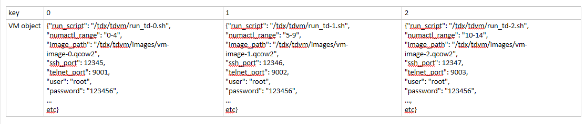

## TDX Setup Instructions
### Introduction
For EagleStream, test content should be run on both Windows and Linux OSs.  VMware ESXi is not a POR OS for EGS and is a 
POC not covered at this time by Platform Validation.

For Linux, the OTC team publishes a SW stack containing installation packages for qemu-kvm, libvirt, and host 
kernel.  The latest BKC packages include a link to the repository to the latest release.  The host OS 
for this SW stack is CentOS 8 Stream  Further detailed set up instructions can be found at the TDX Install test case on 
TDX Usage wiki owned by OTC team: https://goto/tdx-enabling

On Linux, there are nuances with launching virtual machines:
1. SSH to TD guest is facilitated through SSH tunneling from the VM's SSH port to an assigned port on the TDX host.  
This means the VM cannot be SSHed to directly from any system that is not the TDX host itself.  This automation stack 
uses an expect script to execute commands on the TDX host to the VM (template for this script is in 
`collateral/ssh_vm_expect.sh`.  The script is dynamically filled with data from the content_configuration.xml file that 
is installed in C:\Automation on the lab host during dtaf installation.
2. telnet is used to communicate with the QEMU monitor for a given VM; this is used to issue commands like pause, stop, 
shutdown.
3. to run a VM, a bash script is used.  This then writes to a VM specific serial log.  When running the automation, the command to launch the VM is 
launched in an asynchronous session and communication is made with the VM through the SSH tunnel mentioned in #1. 

For Windows, a strictly controlled POC release will be used for Platform Validation testing.  Unless otherwise stated 
in the test case, the scripts for Windows and Linux should be interchangeable.  Please note that the automation will 
determine if Windows or Linux is being used by the \<sut\> tags in the system_configuration.xml file in C:\Automation 
on the lab host.  If you require access to the Windows POC image, please contact your validation lead.  

### Setup Instructions
To run the following test cases successfully, the following set up is required.
1. TDX host OS must be installed following the corresponding test case.  This process is not yet automated.
2. A Linux VM image must exist in the prescribed location in the content_configuration.xml file.  The creation of said 
VM image has not yet been automated.
3. Verify the following fields are completed in the content_configuration.xml file:<TDX>
    ```xml
        <TDX>
            <LINUX>
                <!-- AC cycle instead of warm reset from OS -->
                <AC_RESET>False</AC_RESET>
                <!-- restore BIOS knobs and apply TDX knobs over default settings when preparing test script -->
                <RESET_KNOBS>False</RESET_KNOBS>
                <!-- enable CMCI morphing; this should be set to False to bypass UCNA errors -->
                <CMCI_MORPHING_ENABLE>True</CMCI_MORPHING_ENABLE>
                <!-- if Directory Mode is enabled or not -->
                <DIRECTORY_MODE_ENABLE>True</DIRECTORY_MODE_ENABLE>
                <!-- Volatile Memory Mode to use; should be 1LM or 2LM; 2LM is not supported with TDX on some
                    products -->
                <LM_MODE>1LM</LM_MODE>
                <!-- where to save TDVM images on SUT -->
                <TD_GUEST_IMAGE_DIR>/tdx/tdvm/images/</TD_GUEST_IMAGE_DIR>
                <!-- where to save TDVM images on SUT -->
                <TD_GUEST_IMAGE_DIR>/tdx/tdvm/images/</TD_GUEST_IMAGE_DIR>
                <TD_GUEST_IMAGE_PATH_SUT_CENTOS>/tdx/tdvm/images/test-{}.img</TD_GUEST_IMAGE_PATH_SUT_CENTOS>
                <TD_GUEST_IMAGE_PATH_SUT_RHEL>/tdx/tdvm/images/rhel-{}.img</TD_GUEST_IMAGE_PATH_SUT_RHEL>
                <TD_GUEST_IMAGE_PATH_SUT_UBUNTU>/tdx/tdvm/images/ubuntu-{}.img</TD_GUEST_IMAGE_PATH_SUT_UBUNTU>
                <TD_GUEST_IMAGE_PATH_SUT_WINDOWS>/tdx/tdvm/images/windows-{}.img</TD_GUEST_IMAGE_PATH_SUT_WINDOWS>
                <!-- ready made local image saved to host to copy to SUT, if using one -->
                <TD_GUEST_IMAGE_PATH_HOST_CENTOS>C:/Automation/bkc/tdvm-image/centos.img</TD_GUEST_IMAGE_PATH_HOST_CENTOS>
                <TD_GUEST_IMAGE_PATH_HOST_RHEL>C:/Automation/bkc/tdvm-image/rhel.img</TD_GUEST_IMAGE_PATH_HOST_RHEL>
                <TD_GUEST_IMAGE_PATH_HOST_UBUNTU>C:/Automation/bkc/tdvm-image/ubuntu.img</TD_GUEST_IMAGE_PATH_HOST_UBUNTU>
                <TD_GUEST_IMAGE_PATH_HOST_WINDOWS>C:/Automation/bkc/tdvm-image/windows.img</TD_GUEST_IMAGE_PATH_HOST_WINDOWS>
                <!-- serial path prefix for TD guest serial log to be saved -->
                <TD_GUEST_SERIAL_PATH>/tdx/tdvm/logs/td-guest-serial-{}.log</TD_GUEST_SERIAL_PATH>
                <!-- where TD guest user account -->
                <TD_GUEST_USER>root</TD_GUEST_USER>
                <!-- where TD guest user account password-->
                <TD_GUEST_USER_PWD> </TD_GUEST_USER_PWD>
                <!-- how many vCPU for TD guest, must be a whole number -->
                <TD_GUEST_CORES>1</TD_GUEST_CORES>
                <!-- how much memory for TD guest; format must be a whole number and a capital letter for size (M or G for MB or GB respectively) -->
                <TD_GUEST_MEM>1G</TD_GUEST_MEM>
                <!-- starting host port range for SSH communication to TD guest -->
                <SSH_RANGE_START>10026</SSH_RANGE_START>
                <!-- starting host port range for telnet communication to qemu monitor for TD guest -->
                <TELNET_RANGE_START>9001</TELNET_RANGE_START>
                <!-- how many VMs to launch or create -->
                <NUMBER_OF_VMS>3</NUMBER_OF_VMS>
                <!-- time to wait for VM to boot in seconds -->
                <VM_BOOT_TIMEOUT>60</VM_BOOT_TIMEOUT>
                <!-- number of times to attempt to boot a VM before returning failure -->
                <NUM_VM_BOOT_ATTEMPTS>2</NUM_VM_BOOT_ATTEMPTS>
                <!-- guest OS specs -->
                <VM_OS>CENTOS</VM_OS>
                <!-- location of the BKC package containing the SEAM update collateral -->
                <SEAM_MODULE_PATH_HOST>C:/Automation/bkc/seam_module_1.0_v0.9_b120.zip</SEAM_MODULE_PATH_HOST>
                <SEAM_LOADER_UPDATE_PATH>C:/Automation/bkc/seam_loader_1.0_v0.9_b120.zip</SEAM_LOADER_UPDATE_PATH>
                <!-- if SMX is enabled; workaround for SEAM loader -->
                <SMX_ENABLED>True</SMX_ENABLED>
                <!-- disable or enable DAM for QS -->
				<DAM_ENABLED>True</DAM_ENABLED>
				<!-- attestation script location on the host OS -->
				<TDX_ATTESTATION_STACK_LOCATION>C:/Automation/bkc/Tools/tdx-attestation-1.10.92.2.zip</TDX_ATTESTATION_STACK_LOCATION>
				<E2E_SCRIPT_LOCATION>C:/Automation/bkc/Tools/e2e_scripts.tar.xz</E2E_SCRIPT_LOCATION>
				<!-- SBX API  key from https://sbx.api.portal.trustedservices.intel.com/provisioning-certification -->
				<SBX_API_KEY> </SBX_API_KEY>
				<!-- PCCS user password -->
				<PCCS_PWD> </PCCS_PWD>
                <!-- number of cycles for cycle testing --> 
                <!-- for AC, cold, and warm reset, refer to milestone dpmo requirements for cycle numbers -->
                <!-- for redfish, ipmi, and tdx disable/enable cycles, default is 50 -->	
                <cycling>
						<tdx_disable_cycle>50</tdx_disable_cycle>
						<ipmi_cycles>50</ipmi_cycles>
						<redfish_cycles>50</redfish_cycles>
						<warm_reboot_cycles>250</warm_reboot_cycles>
						<cold_reboot_cycles>250</cold_reboot_cycles>
						<ac_reboot_cycles>250</ac_reboot_cycles>
                        <td_guest_reboot_cycles>50</td_guest_reboot_cycles>
                </cycling>
            </LINUX>
        </TDX>
    ```
### Implementation Details

#### General
As part of test script preparation, the parameters defined above in the C:\Automation\content_configuration.xml file are 
loaded into a dict structure `tdx_properties`.  These values are used as templates for data when creating 
a new VM (TD guest or legacy VM).  It also provides information such as user information, how many VMs to boot, where 
to find locations to copy VM images from, the parameters of all VMs to be created.  

At this time, there is no support for TD guests or VMs created that are not the same OS, user credentials, and specs.

####Linux

For Linux, due to the more complicated method to launch a VM, documentation is necessary for how the structure is 
implemented in this automation.

#####Tracking VMs
A list variable (`tdvms`) is used to track VMs and the VMs properties.  This is to verify that certain values (such as port 
assignments) are not assigned to multiple VMs.  Each element of the list contains a dict which contains the details of 
the VM.  The VM identifier (or the "key") is the index number of the element.

Example of a structure with 3 VMs:


In this example, when interacting with the TD guest, such as with `start_vm` in the `TdxBaseTest` class, one would 
provide the index of the VM with they would want to interact with.  VMs torn down are not considered destroyed as 
the collateral (VM image and script used to start the VM) still exist on the SUT, so the issue of removing elements from 
the VM list is not considered a relevant concern at this point in time in the automation structure.

#####Launching VMs
TD guests and legacy VMs on TDX Linux software stack require use of a bash script to launch.  These bash scripts are 
used with the qemu-kvm command to enumerate the specifics of the VM to be launched.  The sample template launch script 
is used for launching a TD guest as a legacy (non-TD) guest.

When starting a VM with `start_vm`, `tdvms` list checks if a value exists for the key provided.  If one does not exist, 
a new script will dynamically be generated using the template scripts above; a boolean value can be provided to 
`start_vm` as to whether a TD guest or a legacy VM should be created/launched.  The script will also check if an 
assigned image exists for the VM.  If one does not, the automation will attempt to copy an image provided from the
 `tdx_properties` structure.
 
The run script is then copied to the SUT, converted to Unix format,  given executable permissions, and then runs; this 
launches the VM.  
 
####SSHing and Interacting with the VMs     
The launch VM script is run asynchronously, as this command also provides the serial output for the VM.  This 
necessitates a health check through SSH to the VM to verify that is has launched.  After a waiting a prescribed amount 
of time to boot (defined in the `content_configuration.xml` as `VM_BOOT_TIME`), the SUT attempts to SSH to the VM and 
issue a `ls` command with the expect script template described below.  If the VM is reachable, then the function 
returns.  If it is not reachable, an exception is raised, which can be caught in the test script and handled as needed.

Because the VM can only be SSHed to through the TDX host, the SSH process is handled by an expect script which is copied
 from a template located at `collateral/ssh_vm_expect.sh`.  Values are populated to the expect script template 
 (`content_configuration.xml` values `sut_command_time` and the command to execute, respectively), copied to the SUT, 
 converted to Unix format, given executable permissions, and then run.  Results from the VM are returned from the 
 function. 

####Windows
No automation has been finished yet for Windows due to issues with SSH connectivity with test image used by PV.  This is 
in debug.  
